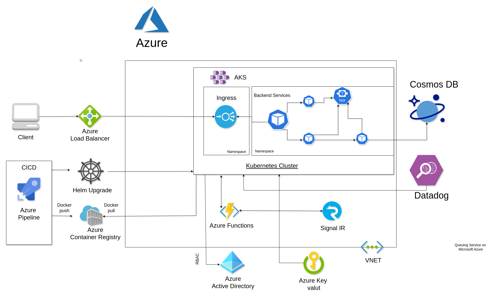

# GenericAppvrx-backend
The server side implementation of the GenericAppVR X will be using this repository

Required the following things to run backend project locally:


## Installation Dependencies
1. Nest CLI (https://docs.nestjs.com/cli/overview)
2. Cosmos Emulator. (https://docs.microsoft.com/en-us/azure/cosmos-db/local-emulator?tabs=cli%2Cssl-netstd21)
3. Azure Functions Core Tools (https://docs.microsoft.com/en-us/azure/azure-functions/functions-run-local?tabs=windows%2Ccsharp%2Cbash)
4. Docker (https://docs.docker.com/engine/install/)
5. Node (https://nodejs.org/en/)

## Run Azure functions
1. Run Cosmos Emulator (https://docs.microsoft.com/en-us/azure/cosmos-db/local-emulator?tabs=cli%2Cssl-netstd21)
2. Open this folder **src\internal\azure-functions** and copy "sample_local.settings.json" and paste it in same place and rename to  "local.settings.json" file add configuration keys. 

### Open this folder (**src\internal\azure-functions** ) in cmd and run this command

```javascript
func host start
```
### Debugging Azure Functions Locally in VS Code 

(https://swaminathanvetri.in/2020/02/07/debugging-azure-functions-locally-in-vs-code/)

### For seed data

After running azure function locally hit this post endpoint (http://localhost:7071/api/seed-data).
It will add all the required container and seed data.


## Run Micro service

Make sure Cosmos Emulator instance is running (https://docs.microsoft.com/en-us/azure/cosmos-db/local-emulator?tabs=cli%2Cssl-netstd21)

#### Three ways to Micro service
### Build and run micro-service using docker
You can find all the command 

**src\dockerize.md** 

### Build and run using NPM Command
open specific service in cmd and run this command 

```javascript
npm run start:dev
```

### Debug backend using VS code
https://javascript.plainenglish.io/debugging-nestjs-in-vscode-d474a088c63b

###


### Unauthenticated API
Add the "external" in API route path to make API unauthenticated (should define in the separate external controller)
